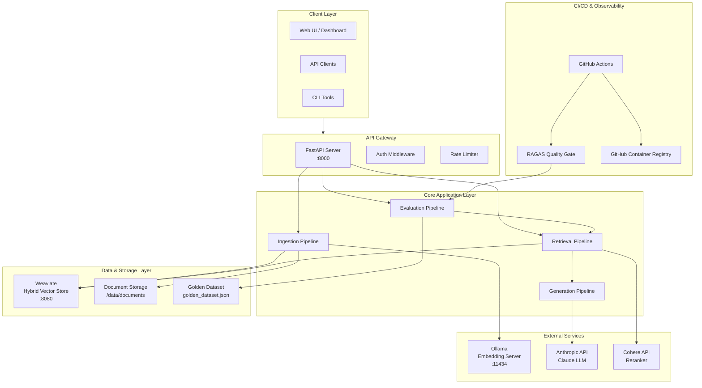
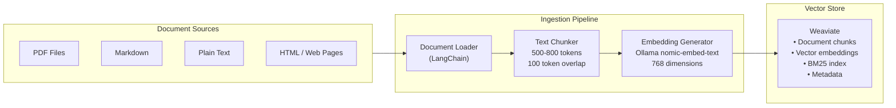
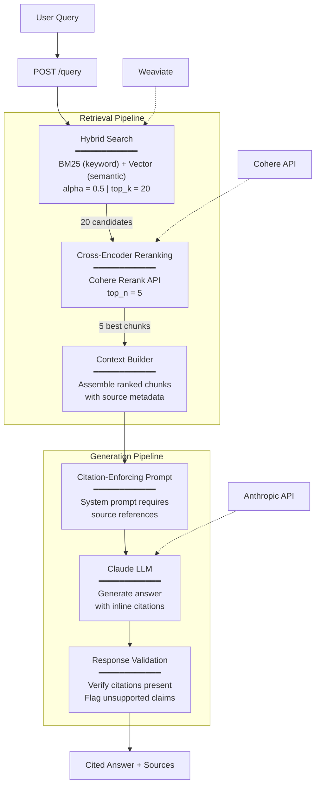
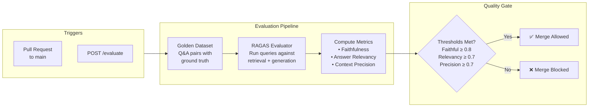
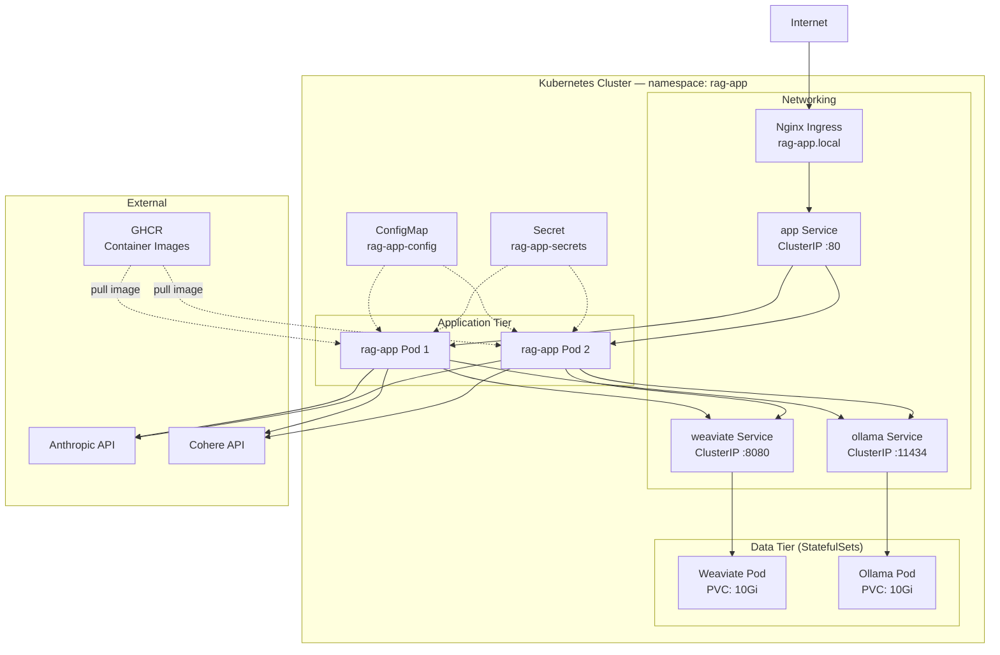
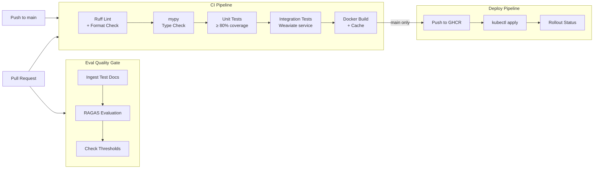

# System Architecture — RAG Enterprise Engine

## 1. High-Level System Overview



## 2. Document Ingestion Flow



## 3. Query & Retrieval Flow



## 4. Evaluation & Quality Gate Flow



## 5. Infrastructure & Deployment



## 6. CI/CD Pipeline



## 7. Component Communication Matrix

| Source | Destination | Protocol | Port | Purpose |
|--------|------------|----------|------|---------|
| Client | FastAPI | HTTP/REST | 8000 | API requests |
| FastAPI | Weaviate | HTTP | 8080 | Vector search & storage |
| FastAPI | Weaviate | gRPC | 50051 | Batch operations |
| FastAPI | Ollama | HTTP | 11434 | Embedding generation |
| FastAPI | Anthropic | HTTPS | 443 | LLM generation |
| FastAPI | Cohere | HTTPS | 443 | Reranking |
| GitHub Actions | GHCR | HTTPS | 443 | Image push/pull |
| Ingress | App Service | HTTP | 80 | Traffic routing |

## 8. Data Flow Summary

```
Documents → Load → Chunk → Embed (Ollama) → Store (Weaviate)
                                                    ↓
User Query → Hybrid Search (BM25 + Vector) → Rerank (Cohere) → Generate (Claude) → Cited Answer
                                                                                        ↓
                                                              Evaluate (RAGAS) → Quality Gate → Deploy
```
